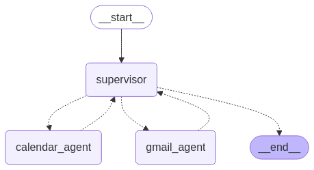

# 🤖 AI Calendar & Email Agent  

An AI-powered assistant that efficiently manages your **Google Calendar** and **Gmail**. This AI agent can **fetch emails, send emails, read events, create new ones, and delete calendar events**, all while ensuring **human confirmation** for critical actions.  

## ✨ Features  

### 📅 **Google Calendar Management**  
- 🔍 **Read Events** – Fetch and display your scheduled calendar events.  
- ✍️ **Create Events** – Add new events to your Google Calendar with AI assistance.  
- ❌ **Delete Events** – Remove events from your calendar upon request.  
- ✅ **Human Confirmation** – Before creating or deleting an event, the AI seeks user confirmation to prevent unintended modifications.  

### 📧 **Gmail Integration**  
- 📥 **Fetch Emails** – Retrieve and summarize your latest emails for quick review.  
- ✉️ **Send Emails** – Compose and send emails with AI assistance, requiring human confirmation before sending.  

## Technologies Used

- [LangGraph](https://github.com/langchain-ai/langgraph) – For building structured conversational workflows.
- [LangChain](https://www.langchain.com/) – Powering AI reasoning and interactions.
- [Chainlit](https://docs.chainlit.io/) – Providing an interactive chat interface for user interaction.
- [Google Calendar API](https://developers.google.com/calendar) – To integrate and manage Google Calendar events.

## Overall workflow


## Demo videos

### Get credentials from user
https://github.com/user-attachments/assets/dfd9508d-724f-404d-8684-ac977e5c5ced

### Calendar agent demo
**Task** : Retrieve daily events, remove existing event, and replace them with new event.

https://github.com/user-attachments/assets/0534b916-c1ca-4a70-9b17-0fca6c673a09

### Gmail agent demo
**Task** : Retrieve new emails received during the day, review the details of a specific email, and forward it to another recipient.

https://github.com/user-attachments/assets/dfd9508d-724f-404d-8684-ac977e5c5ced

## Installation & Setup

### Prerequisites
Ensure you have the following installed:
- Python 3.8+
- Google Cloud credentials with Calendar API enabled
- A virtual environment (optional but recommended)

### Steps
1. **Clone the repository**
   ```bash
   git clone https://github.com/hungmanh21/personal_ai_assistant
   cd personal_ai_assistant
   ```
2. **Create a virtual environment** (conda)
   ```bash
   conda create -n personal_ai_assistant python=3.11 -y
   conda activate personal_ai_assistant
   ```
3. **Install dependencies**
   ```bash
   pip install -r requirements.txt
   ```
4. **Set up Google Calendar API credentials**
   - Follow [this guide](https://developers.google.com/calendar/quickstart/python) to obtain OAuth 2.0 credentials.
   - Place your `credentials.json` file in the project root directory.

5. **Set up your env like format in `.env.dev`** to use AzureOpenAI (optional)
6. If you dont use AzureOpenAI, please change the model in file `llm.py`
7. **Run the application**
   ```bash
   chainlit run app.py
   ```

On the first run time, the system might prompt you to grant access to your Google Calendar. Follow the instructions below
1. When prompted, click the "Continue" button to proceed.

2. Ensure you select all required permissions for smooth integration.

3. Once permissions are granted, close the window. You’re all set! 🎉
Now, return to the chat and enjoy using the system!

## Usage
- Interact with the AI agent through the Chainlit interface.
- Ask it to read, create, or delete events.
- Confirm before making modifications to your calendar.

## Contributing
Feel free to fork this repository, submit issues, or contribute via pull requests!

## TODOs

- [x] **Memory**: Implement long-term memory so the agent can remember user notes and preferences.
- [ ] **Voice Interaction**: Add support for voice input from the user and voice responses from the agent.
- [ ] **LLM Observability**: Enable tracing of LLM calls for debugging and analysis.

